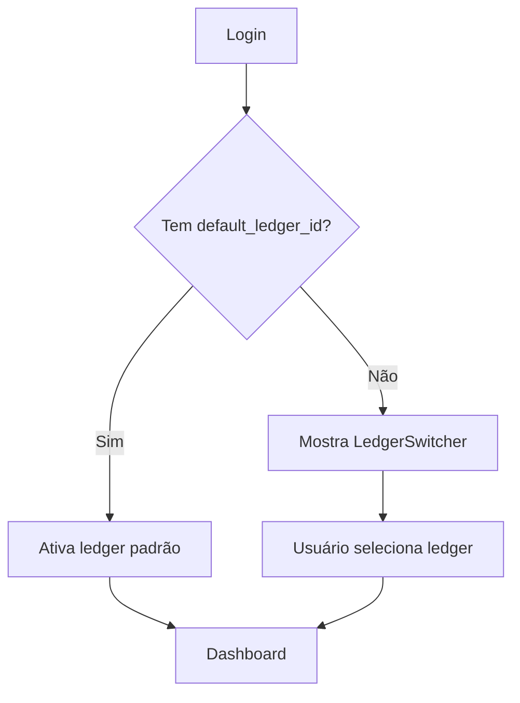

# Implementação de Ledger Padrão e Gestão de Membros

**Data**: 2026-01-05
**Status**: Planejado
**Objetivo**: Permitir que usuários definam um ledger padrão nas preferências e gerenciem membros/permissões

---

## Resumo Executivo

Implementar funcionalidade para:

1. Usuário selecionar um ledger padrão que será automaticamente ativado no login
2. Listar ledgers com seus membros e permissões na aba "Ledger" das configurações
3. Gerenciar acesso de outros usuários aos ledgers (convidar, editar permissão, remover)

---

## Mudanças Já Realizadas

- [x] Removido `ensureLedger()` de `frontend/app/plugins/auth-bootstrap.client.ts`

---

## Proposta de Implementação

### 1. Backend - Preferências de Usuário

#### `internal/domain/preferences/entity.go`

Adicionar campo `default_ledger_id`:

```go
type UserPreferences struct {
    // ... campos existentes
    DefaultLedgerID *string `json:"default_ledger_id"` // nullable
}
```

#### Na Migration 001

```sql
ALTER TABLE user_preferences
ADD COLUMN default_ledger_id UUID REFERENCES ledgers(id);
```

#### `internal/adapters/http/handlers/preferences.go`

Atualizar endpoints GET/PUT para incluir `default_ledger_id`.

---

### 2. Backend - API de Membros do Ledger

#### `internal/domain/ledger/member.go` (novo)

```go
type LedgerMember struct {
    ID          string    `json:"id"`
    LedgerID    string    `json:"ledger_id"`
    UserID      string    `json:"user_id"`
    Role        string    `json:"role"` // owner, editor, viewer
    DisplayName string    `json:"display_name"`
    Email       string    `json:"email"`
    AvatarURL   string    `json:"avatar_url,omitempty"`
    JoinedAt    time.Time `json:"joined_at"`
}
```

#### `internal/adapters/http/handlers/ledger.go`

Novos endpoints:

| Método | Rota                             | Descrição                  |
| ------ | -------------------------------- | -------------------------- |
| GET    | `/ledgers/:ledgerId/members`     | Lista membros              |
| POST   | `/ledgers/:ledgerId/members`     | Convida membro (por email) |
| PUT    | `/ledgers/:ledgerId/members/:id` | Atualiza permissão         |
| DELETE | `/ledgers/:ledgerId/members/:id` | Remove membro              |

---

### 3. Frontend - Composables

#### `layers/shared/composables/usePreferences.ts`

Adicionar tipo e lógica para `default_ledger_id`:

```typescript
export type UserPreferences = {
  // ... existentes
  default_ledger_id: string | null;
};
```

#### `layers/ledgers/composables/useLedgerMembers.ts` (novo)

```typescript
export const useLedgerMembers = () => {
  const members = ref<LedgerMember[]>([])
  const loading = ref(false)

  const fetchMembers = async (ledgerId: string) => { ... }
  const inviteMember = async (ledgerId: string, email: string, role: LedgerRole) => { ... }
  const updateRole = async (ledgerId: string, memberId: string, role: LedgerRole) => { ... }
  const removeMember = async (ledgerId: string, memberId: string) => { ... }

  return { members, loading, fetchMembers, inviteMember, updateRole, removeMember }
}
```

---

### 4. Frontend - Settings Page

#### `layers/core/pages/settings.vue`

Na aba "Ledger":

1. **Select de Ledger Padrão**
   - Dropdown com ledgers do usuário
   - Auto-save ao selecionar
2. **Lista de Ledgers com Membros**

   - Cards expandíveis para cada ledger
   - Mostra role do usuário atual
   - Lista de membros com avatares

3. **Modal de Convidar Membro**
   - Input de email
   - Select de role (editor/viewer)
   - Botão convidar

---

### 5. Frontend - Bootstrap de Ledger

#### `app/plugins/auth-bootstrap.client.ts`

Após login, verificar `default_ledger_id` das preferências:

```typescript
// Após carregar preferências
if (preferences.default_ledger_id) {
  await ledgerContext.setActiveLedger(preferences.default_ledger_id);
}
```

---

## Fluxo de Usuário



---

## Tarefas Ordenadas

1. [ ] Migration: adicionar `default_ledger_id` na tabela
2. [ ] Backend: atualizar entity e repository de preferences
3. [ ] Backend: atualizar handlers de preferences
4. [ ] Backend: criar entity e repository de ledger_members
5. [ ] Backend: criar handlers de ledger_members
6. [ ] Frontend: atualizar types em usePreferences
7. [ ] Frontend: criar composable useLedgerMembers
8. [ ] Frontend: implementar UI de ledger padrão em settings
9. [ ] Frontend: implementar UI de lista de membros
10. [ ] Frontend: implementar modal de convite
11. [ ] Frontend: atualizar auth-bootstrap para usar default_ledger_id
12. [ ] Testes e ajustes finais

---

## Estimativa

| Componente | Tempo          |
| ---------- | -------------- |
| Backend    | ~2-3 horas     |
| Frontend   | ~3-4 horas     |
| **Total**  | **~5-7 horas** |

---

## Verificação

- [ ] Ao fazer login, o ledger padrão é ativado automaticamente
- [ ] Se não há ledger padrão, o LedgerSwitcher funciona normalmente
- [ ] Usuário pode alterar ledger padrão nas configurações
- [ ] Lista de membros aparece corretamente para cada ledger
- [ ] Convite por email funciona (owner/editor apenas)
- [ ] Permissões são respeitadas (viewer não pode editar nada)
